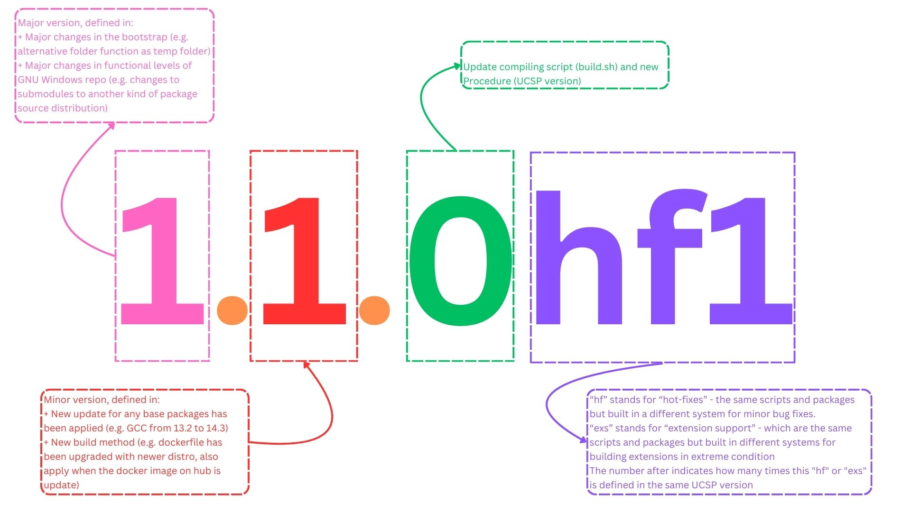

# Administration Guide

> :warning:
>
> Note that this guide can only be affected if you have read-write access to the project.

## Versioning system

The versioning system of GNU Windows follows this guide:



> Note: In the same UCSP versioning family, the later of each "hf" or "exs" is, the newer of that release is.

### Single stream version

Single stream version means GNU Windows only supports one-way versioning. That means, once any minor or major version once released, it is no longer supported and must wait for a newer version to resolve existing bugs.

## Guidance in updating the submodule

Each submodule has its own `master` branch, primary contains the `README` of hint and all other branches are for an actual mirror of its versions.

Take the repo [busybox-w32](https://github.com/tfslabs/busybox-w32) as an example. By default, the repo has `master` as the primary branch, and its first version captured `FRP-5467-g9376eebd8`.

### Starting an upgrade of the submodule repo

It is required not to remove any older versions in any circumstances.

The administrators must follow this path to perform an upgrade to the `master` branch of GNU Windows:

1. Upgrading the submodule by going into the repo. Create a newer branch (based on the `master`), and rename it with the version name.

2. In the new branch, go to file `.github/workflows/core.yml` or `.github/workflows/blank.yml` and edit the workflow. You have to take note of these locations:

> + `branches:` - you must remove `no-available-just-rename-in-case-you-want` and replace it with the name of the current branch
>
> + `name: Obtain source code from` - you must define the host after that, and make sure the `wget` command under there can download the file with a proper name
>
> + In `Extract Source Code into Root Directory`, make sure the `tar` command can extract the compressed file
>
> + In `Commit Changes`, it is necessary to add commands of the downloaded compressed source code, `.github/workflows/*.yml`, and `.gitignore`. It is because the source code is already clean and shouldn't contain any builds or binaries
>
> + Commit message should contain the `name` (you can copy it on the first line) and its version.
>
> + If all are passed, it is good to commit that file and wait for GitHub Action to take an action and commit the source code from the compressed file.

3. Once everything is done, check again the source code for missing files and violated file names.

## Migrate the new version of submodules into GNU Windows

Take a look at this diagram of the branching system.

```git
-> alt-master (archived)
    |
    -> master
        |
        -> new-docs-goes-here
        |
        -> new-git-config-files-goes-here
        |
        -> new-script-for-building-goes-here
            |
            -> new-submodule-updates-goes-here
```

### Naming branches

GNU Windows is based on a versioning system to deliver packages for users. Before any actions into the master branch, it is necessary to verify everything, by Repository Admins or Organization Admins.

The naming branch system must follow this:

> Prefix: it should be the release version
>
> Suffix:
>
> + For scripts, docs, and git configurations: go with `git-config`, `scripts`, or `docs`, then the reasons or which changed
> + For new submodule migrate into, goes with `<package-name>-<version>`
>
> Note that between the prefix, suffix, and each content of suffix, the separations must be the dash (`-`)

### Migrate procedure

To migrate any new submodule into the `master` of GNU Windows, it is necessary to check out this procedure:

1. Create a new `new-script-for-building-goes-here` branch that follows the above rule of naming branches, and the newer branch is based on the `master`.

2. Inside it, create a new branch for the new submodule goes into. Follow the naming branches above.

3. You must check out a newer version of the package, by using these commands (replace `<submodule_name>` and `<newer_version>`). Don't forget to `git checkout` that branch before committing.

```bash
cd <submodule_name>
git fetch
git checkout <newer_version>
cd ..
git add .
git commit -m "Update version <newer_version> for <submodule_name>"
```

4. Once everything is checked, create a new request on GitHub and wait for Project Managers, Repo Admins, or Organization Admins to submit the changes.
5. If your PR is merged into the newer script update branch, it is good for you to switch to that branch, re-write the script to adapt to the newer packages, commit it, and then create another PR to migrate that branch of the new script and package into `master` branch.

> :warning:
>
> Before actual PR is completed and everything has been verified carefully, the Project Managers, Repo Admins, or Organization Admins may ask you to submit the newer version of packages in [run_admin.sh](./run_admin.sh). It is for other developers can continue to work based on your work, without asking which version of the package you are just pushed onto.

## Updating GNU Windows extensions

> Only [`curl`](https://github.com/tfslabs/curl-gnu-windows), [`zlib`](https://github.com/tfslabs/zlib-gnu-windows), [`openal`](https://github.com/tfslabs/openal-gnu-windows), [`vorbis`](https://github.com/tfslabs/vorbis-gnu-windows), [`ogg`](https://github.com/tfslabs/ogg-gnu-windows), and [`meson+ninja`](https://github.com/tfslabs/meson-ninja-gnu-windows) are the classic extensions, since these are available from the version 1.0.0.

### Classic GNU Windows extensions

Classic extensions use the `master`/`main` branches as the primary distribution source. Any release that will the fork of the primary branches.

Take CURL for GNU Windows as an example. It only has a single stream, and even the release is the fork of the primary branch.

#### Updating the classic extensions

Most of the GNU Windows extensions that sources can be downloadable from [MSys2 repo](https://repo.msys2.org/mingw/sources). It is recommended that you have to create a fork and name it as the version of the package you want to commit.

Once the download is completed, extract it into the clone repo. Make sure you delete the source, except these following files.

* `README.md`, `CODE_OF_CONDUCT.md`, `SECURITY.md` (Docs files)
* `build.cmd` - Pre-defined and the automatic build script for GNU Windows.
* Any files that in the `build.cmd` (like `.py`), since these files are essential part of building system, EXCEPT it is already available in the package

After extracting, you must update all of the `.patch` file before building the package. It is because most of the packages are available in Linux, and may not be compatible with Windows.

#### Release the package

When your binaries are ready, you can put these in a container of `.7z`, `.zip`, and `.tar.gz`.

The release tag must follow this pattern

```txt
<package-name>-<version of GNU Windows>-gnu-windows
```

#### Updating the modern extensions

Most of the GNU Windows extensions that sources can be downloadable from [MSys2 repo](https://repo.msys2.org/mingw/sources). It is required that all of your sources before uploading onto the GitHub.

Once the download is completed, extract it into the clone repo. Make sure you delete the source, except these following files.

* `build.cmd` - Pre-defined and the automatic build script for GNU Windows.
* Any files that in the `build.cmd` (like `.py`), since these files are essential part of building system, EXCEPT it is already available in the package

After extracting, you must update all of the `.patch` file before building the package. It is because most of the packages are available in Linux, and may not be compatible with Windows.

#### Release the package

When your binaries are ready, you can put these in a container of `.7z`, `.zip`, and `.tar.gz`.

The release tag must follow this pattern

```txt
<version of the package>-gnu-windows-<gnu windows version>
```
